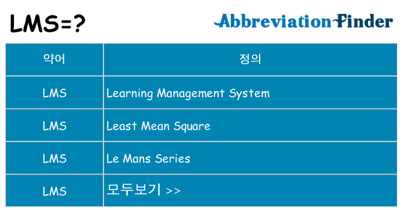
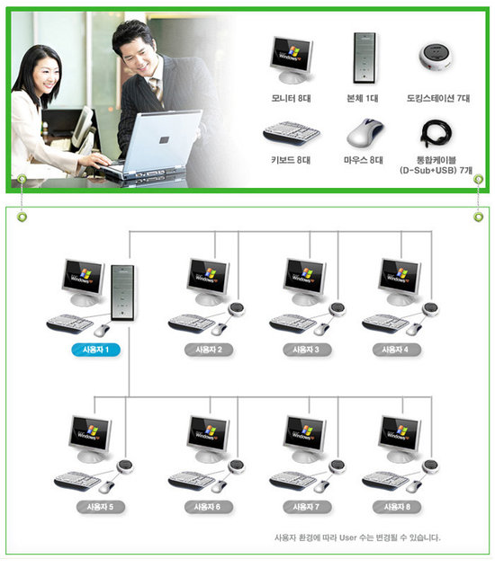
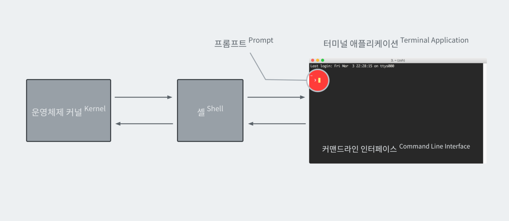
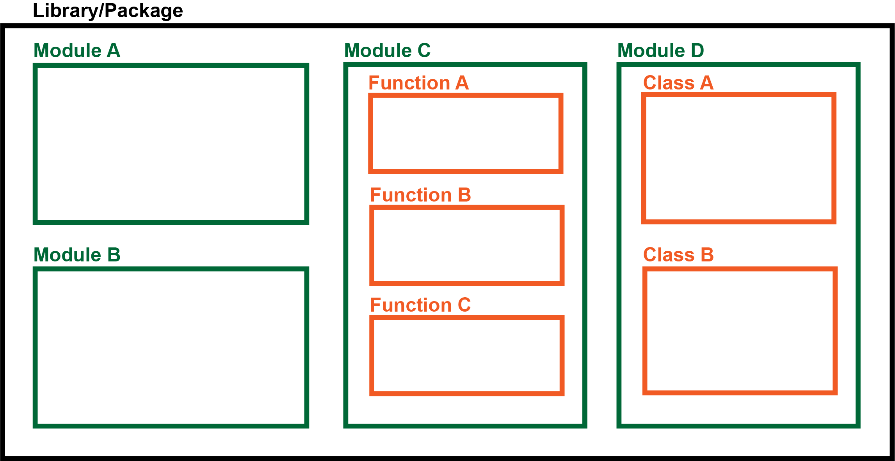
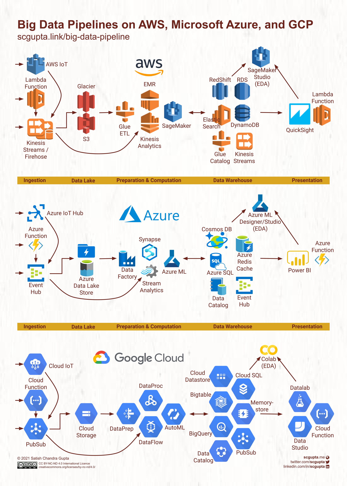

# 01_Ready_to_go

aiffel lms 환경의 이해

AIFFEL LMS 활용을 위한 사용자 환경 구성이 완료되었는지 점검하고, 미완료시 꼭 필요한 환경 구성이 진행될 수 있도록 안내한다.

## 목차

***

- [LMS 200% 활용하기](#lms-200-활용하기)
  - [LMS란?](#lms란)
  - [LMS 핵심 기능](#LMS-핵심-기능)
- [안녕, 우분투](#안녕-우분투)
- [삐삑! 환경 구성 나와라, 오버](#삐삑-환경-구성-나와라-오버)
- [커널 실행하기](#커널-실행하기)
- [코드 실행 확인하기](#코드-실행-확인하기)

## LMS 200% 활용하기

***

### LMS란?

***

Learning Management System == 교육 관리 시스탬

### LMS 핵심 기능

***

- 퀴즈 블록
  - 직접 생각해보고 작성하기!
- [코드 블록](#코드-실행-확인하기)
- 디테일 토글
  - 코드 힌트, 내용 힌트 등이 기록됨
- 블록 리스트
  - 내가 완료한 퀴즈 & 코드 블록 확인
  - 완료가 되어야 다음 노드로
- [클라우드 / 로컬 환경](#삐삑-환경-구성-나와라-오버)

## 안녕, 우분투

***

### OS란?

[자원을 효율적으로 사용하게 해주고 관리해 주는 시스템](https://m.blog.naver.com/PostView.naver?isHttpsRedirect=true&blogId=pst8627&logNo=221663921157)

### OS 종류

- 리눅스
  - 오픈 소스 기반 운영체제 == 무료
  - 다중 사용자 기능 == 컴퓨터 한 대에 다양한 유저
    - 
  - 이식성 == 다양한 환경에서 작동
    - 
  - 높은 안정성 == 서버에 사용
- [우분투](https://unit-15.tistory.com/104)
  - 리눅스 기반 OS == 무료
  - 많은 개발자들이 이용함
  - 우리가 사용하게 될 library가 우분투에서 개발됨 == 안정적으로 구동
- 윈도우
  - 상용 OS == 비쌈
  - GUI가 기본 == 배우기 쉬움
- 맥 OS
  - apple 전용 OS

## 삐삑! 환경 구성 나와라, 오버

***

### 쉘이란?

***
명령어와 프로그램을 실행할 때 사용하는 인터페이스

시스템 사용자와 커널이 커뮤니케이션 하는 프로그램, 크게 CLI(Command Line Interface)와 GUI(Graphical User Interface)

> ### 쉘? 커널? CLI? + 터미널, 콘솔
>
> 
>
> - 쉘(Shell)이란?
>   - 명령을 처리하고 결과를 출력하는 프로그램
> - 커널(Kernel)이란?
>   - 하드웨어와 응용 소프트웨어에서 중간자 역할을 하는 프로그램
>   - `보안`, `자원관리`, `추상화`의 역할이 있음
>     - )
> - CLI이란?
>   - 사용자가 텍스트로 명령어를 입력 -> 텍스트로 결과를 출력
> - 터미널(Terminal)이란?
>   - 입력과 출력이 가능한 하드웨어 장비
>   - 하지만, 최근엔 `쉘을 실행하는 래퍼 프로그램`이란 뜻으로 사용
> - 콘솔(Console)이란?
>   - 물리적 터미널
>     - 
>
> |터미널|콘솔|쉘|
> |:-:|:-:|:-:|
> |입력 & 출력 환경|물리적 터미널|명령어 인터프리터|
> |명령 프롬프트|Xbox|cmd|

### 패키지란?

***

여러 모듈을 묶은 것

> ### 라이브러리? 패키지? 모듈? 함수? 클래스? 프레임워크?
>
> 
>
> - 라이브러리(Library)란?
>   - 일종의 목표 기능이 있는 코드 모음
>   - ex) 시각화(matplotlib)
> - 패키지(Package)란?
>   - 설치하여 사용 가능한 라이브러리
> - 모듈(Module)이란?
>   - 기능별로 분리한 각 파일
>   - ex) 다양한 출력 방법별로 나눠서 관리
> - 함수(Function)이란?
>   - 하나의 기능을 가진 코드
>   - ex) 출력 담당, 크기 변경 담당
> - 클래스(Class)란?
>   - 객체 지향 프로그래밍을 하기 위한 틀
> - 프레임워크(Flamework)란?
>   - 특정 프로그램을 개발하기 위한 요소를 모아서 룰을 제공한 프로그램

## Cloud

***

데이터를 인터넷과 연결된 중앙 컴퓨터에 저장하여 필요할 때 데이터를 이용함

### 종류

### 장단점

|AWS|Azure|GCP|
|:-:|:-:|:-:|
|네트워킹부터 로봇까지 대부분 서비스 이용 가능|서비스가 저렴|컨테이너화된 workroad의 지원|
|수많은 서비스로 이해가 어려움|기업 대상 Cloud|제한된 서비스|

## 관련 링크

***
|날짜|제목(링크)|내용|
|:-:|:--------:|:--:|
|?|[LMS](https://www.abbreviationfinder.org/ko/acronyms/lms.html)|다양한 LMS의 의미|
|19.10.06|[OS](https://m.blog.naver.com/PostView.naver?isHttpsRedirect=true&blogId=pst8627&logNo=221663921157)|OS의 뜻과 종류|
|09.08.31|[다중 사용자](http://it.chosun.com/site/data/html_dir/2009/08/31/2009083185032.html)|컴퓨터 : 사용자 = 1:다|
|17.12.25|[이식성](https://www.youtube.com/watch?v=lbkhHBdRUCI)|다양한 장비에 사용될 수 있음|
|21.11.28|[우분투](https://unit-15.tistory.com/104)|우분투는 리눅스 배포판|
|21.06.29|[터미널, 콘솔, 쉘](https://www.geeksforgeeks.org/difference-between-terminal-console-shell-and-command-line/)|다른 점|
|22.07.04|[커널](https://ko.wikipedia.org/wiki/커널_(컴퓨팅))|커널이란? 커널의 종류|
|20.06.30|[패키지, 라이브러리, 모듈](https://thinkreen.github.io/python/py-FunctionModuleClass/)|다른 점|
|21.10.01|[AWS, Azure, GCP](ttps://www.bmc.com/blogs/aws-vs-azure-vs-google-cloud-platforms/)|장단점|
